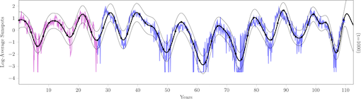

# Continual Gaussian Processes

This repository contains the implementation of our Continual (Multi-task)  Gaussian Process model. We provide a detailed code for single-output GP regression, multi-output GP regression, GP classification and long-term continual learning.

Please, if you use this code, cite the following [preprint](https://arxiv.org/abs/1911.00002):
```
@article{MorenoArtesAlvarez19,
  title = {Continual Multi-task Gaussian Processes},
  author = {Moreno-Mu\~noz, Pablo and Art\'es-Rodr\'iguez, Antonio and \'Alvarez, Mauricio A},
  journal = {arXiv preprint arXiv:1911.00002},
  year = {2019}
}
```
*Solar sunspots data.*



**Results:** In the /experiments/ folder you may find the following scripts for simulations.

```
single_output.py // Continual GP regression
multi_output.py  // Continual multi-output GP regression
banana.py        // Continual GP classification
solar.py         // Long-term continual GP regression (figure above).
```

The Python syntaxes of likelihood distributions and the structure of our code is based on the [HetMOGP](https://github.com/pmorenoz/HetMOGP) repository.

## Contributors

[Pablo Moreno-Muñoz](http://www.tsc.uc3m.es/~pmoreno/), [Antonio Artés-Rodríguez](http://www.tsc.uc3m.es/~antonio/) and [Mauricio A. Álvarez](https://maalvarezl.github.io/)

For further information or contact:
```
pmoreno@tsc.uc3m.es
```
